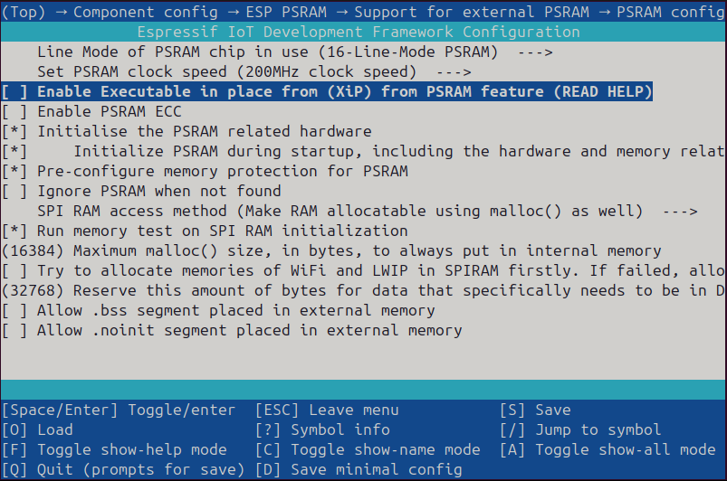

# PP-OCRv6 Example

Real-time text detection + recognition on the camera stream using
[PP-OCRv6](https://github.com/PaddlePaddle/PaddleOCR). The LCD shows a
two-pane overlay: the left canvas is the OCR-input frame with colored
detection quads, the right panel shows the recognized text at the same
vertical position as each quad.

## Supported Targets / BSPs

| Chip      | BSP                              |
|-----------|----------------------------------|
| ESP32-P4  | `esp32_p4_function_ev_board`     |

## Interaction

Touch screen buttons.

| btn   | operation                                    |
|-------|----------------------------------------------|
| SCAN  | run OCR on the next captured frame and hold  |
| LIVE  | resume live preview                          |

## How to use

Follow the [Quick Start](../../README.md#quick-start). `esp-who` extends
`idf.py` for BSP selection, so `IDF_EXTRA_ACTIONS_PATH` must point at the
repo's `tools/` directory (also documented in the top-level
[README](../../README.md)) — otherwise the first `set-target` errors out
with `BSP is not defined, please make sure that the environment variable
IDF_EXTRA_ACTIONS_PATH is properly set.`.

```bash
export IDF_EXTRA_ACTIONS_PATH=/path_to_esp-who/tools/
idf.py -DSDKCONFIG_DEFAULTS=sdkconfig.bsp.esp32_p4_function_ev_board set-target esp32p4
idf.py flash monitor
```

## Configuration

All PP-OCRv6 knobs (`REC_S16` vs `REC_S8`, `SHORT` vs `DUAL` width
mode, model location, drop score, ...) live under **models: pp_ocr_v6**
in `idf.py menuconfig`. The default (`SHORT` + `REC_S16` + flash
rodata) is pinned in `sdkconfig.bsp.esp32_p4_function_ev_board`.

`DUAL` mode needs the model weights out of PSRAM. Pick one of these
two paths (both configurable via `idf.py menuconfig`):

- **Flash rodata** — turn XIP off so `.flash.rodata` isn't mirrored
  into PSRAM at boot. In `idf.py menuconfig` navigate:
  `Component config` → `ESP PSRAM` → `Support for external PSRAM` →
  `PSRAM config` → uncheck **Enable Executable in place from (XiP)
  from PSRAM feature (READ HELP)**:

  

  `param_copy=false` at the two `new dl::Model(...)` call sites is
  applied automatically by
  [`patches/pp_ocr_v6_param_copy_false.patch`](patches/README.md) on
  every `idf.py reconfigure`, so nothing else to do. `param_copy=false`
  is only honored when XIP is off (with XIP on, params come from the
  PSRAM XIP mirror regardless).

- **Flash partition** — the model lives in its own partition, so XIP
  can stay on (XIP only mirrors the main firmware's rodata, not other
  partitions):
  - `models: pp_ocr_v6` → `model location` → **flash_partition**
  - `Partition Table` → `Custom partition CSV file` → **partitions2.csv**

  `param_copy=false` (applied by the same patch as above) then reads
  params directly from the partition's flash cache instead of copying
  them to PSRAM heap.

Either path trades ~2× slower `det:model` (flash-cache latency vs
PSRAM) for enough headroom to fit the second rec model.

> **Note (`SHORT` + `flash_partition`)**: this combination also runs
> at the ~2× slower speed. The `param_copy=false` from
> `patches/pp_ocr_v6_param_copy_false.patch` is a no-op for
> `flash_rodata + XIP=y` (params come from the PSRAM XIP mirror either
> way), but in `flash_partition` mode it always takes effect regardless
> of XIP — the model bytes are read from the partition via flash cache.
>
> If you're on `SHORT` and want partition layout at full speed, edit
> [`patches/pp_ocr_v6_param_copy_false.patch`](patches/README.md) to flip
> `false` back to `true` in both hunks (or drop the patch entirely — remove
> it from `patches/apply_patches.cmake` and let upstream's `param_copy=true`
> default apply). Params are then `memcpy`'d into a ~3 MB PSRAM heap block
> at load time, which SHORT has budget for.

A 24 pt Noto Sans CJK SC subset (`main/assets/pp_ocr_v6_cjk_24.c`, SIL
OFL) is bundled and enabled by default so non-Latin recognition results
render correctly. To rebuild it from a different TTF, see
[main/assets/README.md](main/assets/README.md).

To run without a display, swap `WhoPPOCRV6AppLCD` for
`WhoPPOCRV6AppTerm` in `main/app_main.cpp`.
